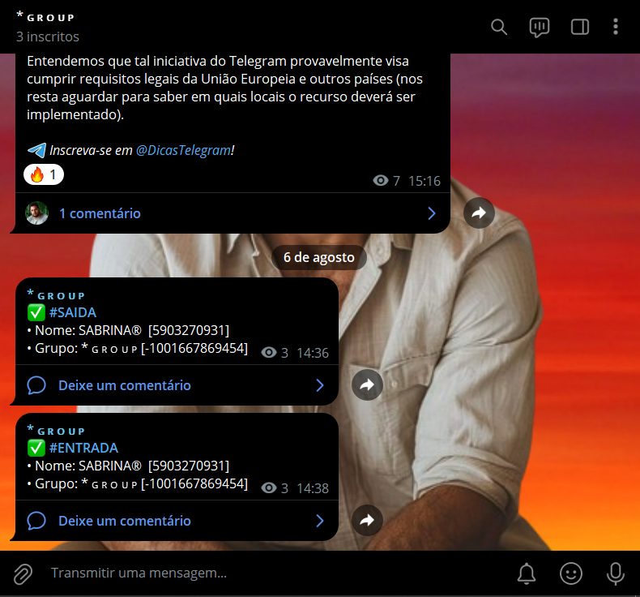

# LOGS DE GRUPOS
👮‍♂️VOCÊ PODE FACILMENTE MONITORAR E REGISTRAR ATIVIDADES IMPORTANTES EM SEUS GRUPOS DO TELEGRAM, MANTENDO UM REGISTRO DETALHADO NO CANAL DE LOG!

 <br>

## DESCRIÇÃO:
Este bot de Telegram, chamado "Logs de Grupos", é projetado para registrar e enviar logs detalhados de eventos importantes que ocorrem em grupos onde o bot é administrador. Esses logs são enviados para um canal específico designado para registros. O bot monitora os seguintes eventos:

1. **Entradas no Grupo**: Registra todos os usuários que entram no grupo.
2. **Saídas do Grupo**: Registra todos os usuários que deixam o grupo.
3. **Ações de Moderação**: Registra bans, mutes, kicks, unbans e unmutes aplicados manualmente pelos administradores ou moderadores.

## FUNCIONALIDADES:
- **Registro de Entradas**: Quando um novo membro entra no grupo, o bot registra o nome, ID do usuário e o nome do grupo, enviando essa informação para o canal de log.
  
- **Registro de Saídas**: Quando um membro deixa o grupo, o bot registra o nome, ID do usuário e o nome do grupo, enviando essa informação para o canal de log.
  
- **Ações de Moderação**: Quando um administrador aplica uma ação de ban, mute, kick, unban ou unmute, o bot registra a ação, quem a aplicou, quem foi afetado e o grupo onde a ação ocorreu, enviando esses detalhes para o canal de log.

## EXECUTANDO O PROJETO:
1. **Configuração Inicial:**
   - **Token do Bot**: Crie um bot no Telegram usando o [BotFather](https://t.me/BotFather) e obtenha o token do bot.
   - **Canal de Log**: Crie um canal no Telegram para receber os logs. Adicione o bot ao canal e dê-lhe permissões de administrador.
   - **Grupo**: Adicione o bot ao grupo que deseja monitorar e dê-lhe permissões de administrador.

2. **Arquivo de Configuração**:
   - Abra o arquivo `./CODIGO/CONFIG.py` com o seguinte conteúdo:
   ```python
   TOKEN = "SEU_TOKEN_DO_BOT_AQUI"
   ID_CANAL = "SEU_ID_DO_CANAL_DE_LOGS_AQUI"
   ```
     
   - Substitua `SEU_TOKEN_DO_BOT_AQUI` pelo token do seu bot e `SEU_ID_DO_CANAL_DE_LOGS_AQUI` pelo ID do canal de log. Se você não sabe qual é o id do seu canal, use o [BUSCADOR DE ID](https://github.com/VILHALVA/BUSCADOR-DE-ID).

3. **Instalando as dependências:**
   - Antes de executar o bot, certifique-se de instalar todas as dependências necessárias. No terminal, execute o seguinte comando para instalar as dependências listadas no arquivo `requirements.txt` em `CODIGO`:
   ```bash
   pip install -r requirements.txt
   ```

4. **Inicie o Bot:**
   - Execute o bot do Telegram em Python iniciando-o com o seguinte comando:
   ```bash
   python CODIGO.py
   ```

## NÃO SABE?
- Entendemos que para manipular arquivos em muitas linguagens e tecnologias relacionadas, é necessário possuir conhecimento nessas áreas. Para auxiliar nesse aprendizado, oferecemos alguns subsidios:
* [CURSO DE PYTHON](https://github.com/VILHALVA/CURSO-DE-PYTHON)
* [CURSO DE TELEBOT](https://github.com/VILHALVA/CURSO-DE-TELEBOT)
* [CONFIRA MAIS CURSOS](https://github.com/VILHALVA?tab=repositories&q=+topic:CURSO)

## CREDITOS:
- [PROJETO CRIADO PELO VILHALVA](https://github.com/VILHALVA)
